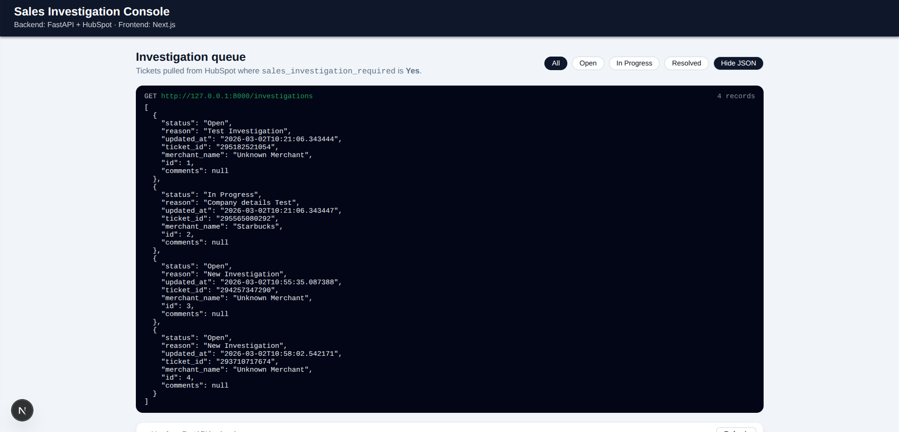
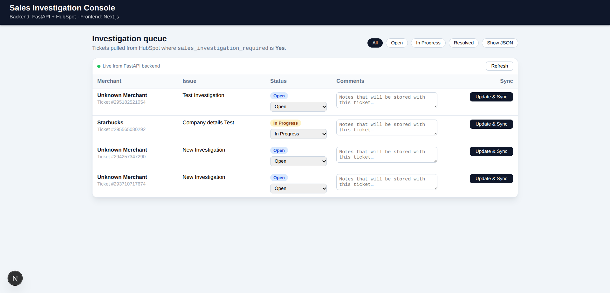

# HubSpot Investigation POC

Small proof-of-concept that:

- Connects a **public HubSpot app** via OAuth.
- Receives tickets that require a sales investigation.
- Stores them in a local **SQLite** database.
- Exposes a **Next.js** dashboard to review and update status, which is synced back to HubSpot.

---

## High‑level architecture

- **Backend**: FastAPI (`backend/`)
  - OAuth install flow (`/install`, `/oauth-callback`).
  - Webhook receiver (`/webhooks`) – optional if you configure HubSpot webhooks.
  - Ticket sync API (`/sync-tickets`) that pulls tickets from HubSpot and writes them to SQLite.
  - Investigation APIs:
    - `GET /investigations` – list local investigation rows.
    - `POST /investigations/{ticket_id}/status` – update a ticket status + comments in HubSpot and the local DB.
- **Frontend**: Next.js (`frontend/`)
  - One page at `/` that:
    - Calls `GET /investigations`.
    - Lets you change **status** and **comments** per ticket.
    - Calls `POST /investigations/{ticket_id}/status` to sync back to HubSpot.

---

## Example JSON payload from backend

After you run `/sync-tickets`, a call to:

```bash
curl http://127.0.0.1:8000/investigations
```

returns an array of investigations. Example:

```json
[
  {
    "ticket_id": "295182521054",
    "merchant_name": "Unknown Merchant",
    "id": 1,
    "comments": null,
    "status": "Open",
    "reason": "Test Investigation",
    "updated_at": "2026-03-02T10:21:06.343444"
  },
  {
    "ticket_id": "295565080292",
    "merchant_name": "Starbucks",
    "id": 2,
    "comments": null,
    "status": "In Progress",
    "reason": "Company details Test",
    "updated_at": "2026-03-02T10:21:06.343447"
  }
]
```

The frontend reads exactly this shape.

---

## File structure

```text
hubspot-poc/
  backend/
    main.py           # FastAPI application (OAuth, sync, investigations API)
    database.py       # SQLAlchemy models + SQLite engine
    .env              # Backend environment variables (NOT committed)

  frontend/
    package.json      # Next.js app config and scripts
    next.config.mjs   # Minimal Next.js config
    app/
      layout.js       # Root layout and shell
      page.js         # Dashboard UI calling the backend
      globals.css     # Global CSS reset

  README.md           # This file
  venv/               # Python virtualenv (local only, ignored by git)
  docker-compose.yml  # Docker orchestration for backend + frontend
  backend/Dockerfile  # Backend container image
  frontend/Dockerfile # Frontend container image
```

---

## 1. Create a HubSpot public app and scopes

In your HubSpot developer account:

1. Create a **new public app**.
2. Under **Auth**, set the **Redirect URL** to match what the backend expects, e.g.:
   - `http://localhost:8000/oauth-callback`
3. Under **Scopes**, add at least:
   - `crm.objects.contacts.read`
   - `crm.objects.contacts.write`
   - `crm.objects.companies.read`
   - `crm.objects.companies.write`
   - `tickets`
4. Create a custom ticket property (used to flag investigations), for example:
   - Name: `Sales investigation required`
   - **Internal name**: `sales_investigation_required`
   - Field type: single checkbox / enumeration with a `"Yes"` option.

You will need the app’s **Client ID** and **Client Secret** for the backend.

---

## 2. Backend configuration (`backend/.env`)

Create `backend/.env` with **your own** credentials (do not commit them):

```bash
CLIENT_ID=your_hubspot_client_id_here
CLIENT_SECRET=your_hubspot_client_secret_here
REDIRECT_URI=http://localhost:8000/oauth-callback
```

The `REDIRECT_URI` must match what you configured in your HubSpot app.

### Python environment and dependencies

From the project root:

```bash
cd backend
python -m venv ../venv           # if you don't already have a venv
source ../venv/bin/activate

pip install fastapi uvicorn[standard] sqlalchemy python-dotenv requests
```

> If you already have a `venv/` created with these packages, you can just `source ../venv/bin/activate`.

---

## 3. Run the backend (FastAPI)

From the **project root** (important, so Python can import `backend.*`):

```bash
cd ~/hubspot-poc        # adjust to your path
source venv/bin/activate

uvicorn backend.main:app --reload --host 127.0.0.1 --port 8000
```

This starts the API on `http://127.0.0.1:8000`.

---

## 4. Install the HubSpot app (OAuth flow)

With the backend running:

1. Open your browser and go to:
   - `http://127.0.0.1:8000/install`
2. HubSpot will ask you to:
   - Select the target portal (account).
   - Approve the app and scopes.
3. HubSpot redirects back to `REDIRECT_URI` (e.g. `http://localhost:8000/oauth-callback`).
   - The backend exchanges the code for tokens and stores them in the local SQLite DB (`tokens` table).
   - On success you should see:
     - `{"message": "Successfully connected to HubSpot!"}`

You must complete this once per portal to allow the backend to call the HubSpot APIs.

---

## 5. Populate the local `investigations` table

There are two ways to get tickets into the local DB.

### Option A: One-shot sync from HubSpot

From a separate terminal (with the backend still running):

```bash
cd ~/hubspot-poc
source venv/bin/activate

curl -X POST http://127.0.0.1:8000/sync-tickets
```

This endpoint:

- Uses the stored HubSpot access token.
- Calls `https://api.hubapi.com/crm/v3/objects/tickets` with:
  - `properties=subject,hs_pipeline_stage,sales_investigation_required`
  - `associations=companies`
- Filters to tickets where:
  - `sales_investigation_required == "Yes"`
- Writes/updates matching rows in the local `investigations` table.

You can verify:

```bash
curl http://127.0.0.1:8000/investigations
```

### Option B: Webhook-based (optional)

The backend also exposes:

- `POST /webhooks`

You can point a HubSpot webhook subscription at this URL and send ticket property change events. When the custom property `sales_investigation_required` becomes `"Yes"`, the backend:

- Looks up the ticket’s subject and associated company.
- Inserts a new `Investigation` row if it doesn’t already exist.

Using `/sync-tickets` (Option A) is the simplest way to get started.

---

## 6. Frontend (Next.js) setup

From the project root:

```bash
cd frontend
npm install
npm run dev
```

This starts Next.js dev server on `http://localhost:3000`.

> The frontend assumes the backend is available at `http://127.0.0.1:8000`.

If you prefer **Docker**, see the next section.

---

## 6b. Running everything with Docker

You can run both backend and frontend with a single command using `docker-compose`:

```bash
cd hubspot-poc

# first build images
docker compose build

# then start the stack
docker compose up
```

This will:

- Start the **backend** container on `http://localhost:8000`.
- Start the **frontend** container on `http://localhost:3000`.

Make sure your HubSpot app `REDIRECT_URI` is set to:

- `http://localhost:8000/oauth-callback`

The OAuth install flow and `/sync-tickets` usage are identical – you just hit the same URLs on `localhost` while the containers are running.

### What the dashboard does

- **GET** `http://127.0.0.1:8000/investigations` to show:
  - Merchant (from associated company when available).
  - Ticket subject (`reason`).
  - Status (`Open`, `In Progress`, `Resolved`).
  - Comments (from the local DB).
- For each row you can:
  - Change **status** via a dropdown.
  - Edit **comments** in a textarea.
  - Click **“Update & Sync”**, which calls:
    - **POST** `http://127.0.0.1:8000/investigations/{ticket_id}/status`
      - Request body:

```json
{
  "status": "In Progress",
  "comments": "Investigating: requested more data from merchant."
}
```

The backend:

1. Maps `status` to a HubSpot pipeline stage (`hs_pipeline_stage`).
2. Calls the HubSpot Tickets API to update the ticket.
3. Updates the local `investigations` row (`status`, `comments`).

Refresh the page or click the **Refresh** button in the UI to confirm changes.

---

## 7. Summary of key URLs

- **Backend (local)**:
  - `http://127.0.0.1:8000/install` – start OAuth install flow.
  - `http://127.0.0.1:8000/oauth-callback` – OAuth redirect URI.
  - `http://127.0.0.1:8000/sync-tickets` – one-shot sync from HubSpot → SQLite.
  - `http://127.0.0.1:8000/investigations` – list investigations (dashboard uses this).
  - `http://127.0.0.1:8000/investigations/{ticket_id}/status` – update status/comments and sync to HubSpot.

- **Frontend (local)**:
  - `http://localhost:3000/` – Sales Investigation Dashboard UI.

---

## 8. Screenshots

### Raw JSON response from `/investigations`



### Frontend dashboard UI



With these steps and URLs, someone new to the repo can:

1. Configure their own HubSpot public app.
2. Plug in their credentials in `backend/.env`.
3. Run the backend and complete OAuth.
4. Sync tickets into the local DB.
5. Start the Next.js frontend and manage investigations from the browser.

